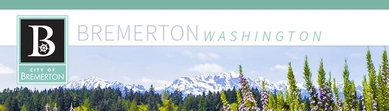

 

||[City of Bremerton Website](http://www.BremertonWA.gov)|
|---|---|
||
||| |---||
||
|City Council Meeting Agenda/Packet & Minutes__City Council Meetings__ - Hybrid meetings will take place until further notice. Begins at 5:30 PM.  Please see [www.BremertonWA.gov](https://www.bremertonwa.gov/691/Council-Meetings) for information     __Study Sessions__ - Hybrid meetings will take place until further notice. Begins at 5:00 PM.  Please see [www.BremertonWA.gov](https://www.bremertonwa.gov/691/Council-Meetings) for information[CLICK HERE](https://meetings.municode.com/subscribe/index?cc=BREM) to subscribe to email notifications for newly available meeting documents.|Meeting|Date|Time|Agenda|Packet| |---|---|---|---|---| |City Council Meeting|4/2/2025|5:00 PM||| |Study Session|3/26/2025|5:00 PM||| |City Council Meeting|3/19/2025|5:00 PM||| |Study Session|3/12/2025|5:00 PM||| |City Council Meeting|3/5/2025|5:00 PM||| |Study Session|2/26/2025|5:00 PM||| |City Council Meeting|2/19/2025|5:00 PM||| |Study Session|2/12/2025|5:00 PM||| |City Council Meeting|2/5/2025|5:00 PM||| |Study Session|1/22/2025|5:00 PM||| |City Council Meeting|1/15/2025|5:30 PM||| |Study Session|1/8/2025|5:00 PM||| |City Council Meeting|1/2/2025|5:30 PM||| |City Council Meeting|12/18/2024|5:30 PM||| |Study Session|12/11/2024|5:00 PM||| |City Council Meeting|12/4/2024|5:00 PM||| |City Council Meeting|11/20/2024|5:00 PM||| |Study Session|11/13/2024|5:00 PM||| |City Council Meeting|11/6/2024|5:00 PM||| |Study Session|10/23/2024|5:00 PM||| |City Council Meeting|10/16/2024|5:00 PM||| |Study Session|10/9/2024|5:00 PM||| |City Council Meeting|10/2/2024|5:00 PM||| |Study Session|9/25/2024|5:00 PM||| |City Council Meeting|9/18/2024|5:00 PM||| |Study Session|9/11/2024|5:00 PM||| |City Council Meeting|9/4/2024|5:30 PM||| |Study Session|8/28/2024|5:00 PM||| |City Council Meeting|8/21/2024|5:00 PM||| |Study Session|8/14/2024|5:00 PM||| |City Council Meeting|8/7/2024|5:00 PM||| |Study Session|7/24/2024|5:00 PM||| |City Council Meeting|7/17/2024|5:00 PM||| |Study Session|7/10/2024|5:00 PM||| |City Council Meeting|7/3/2024|5:00 PM||| |Study Session|6/26/2024|5:00 PM||| |Study Session|6/12/2024|5:00 PM||| |City Council Meeting|6/5/2024|5:00 PM||| |Study Session|5/22/2024|5:00 PM||| |City Council Meeting|5/15/2024|5:30 PM||| |Study Session|5/8/2024|5:00 PM||| |City Council Meeting|5/1/2024|5:00 PM||| |Study Session|4/24/2024|5:00 PM||| |City Council Meeting|4/17/2024|5:30 PM||| |Study Session|4/10/2024|5:00 PM||| |Study Session|3/27/2024|5:00 PM||||| |---||
||
|City of Bremerton City Council Office | 345 6th Street, Suite 600 | Bremerton, WA98337360-473-5280 |[City.Council@ci.bremerton.wa.us](mailto:City.Council@ci.bremerton.wa.us)|

 